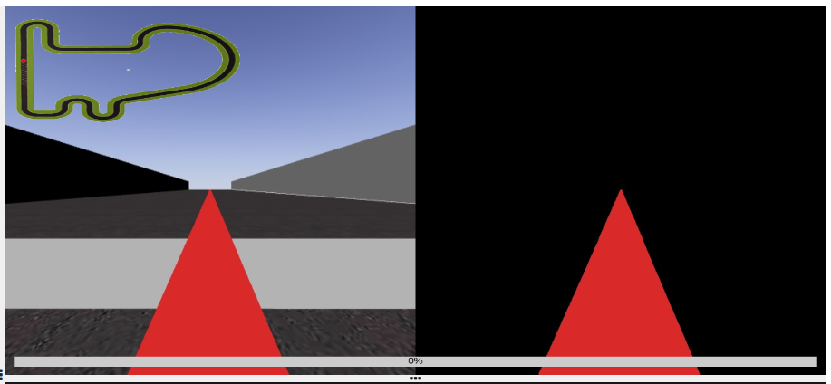
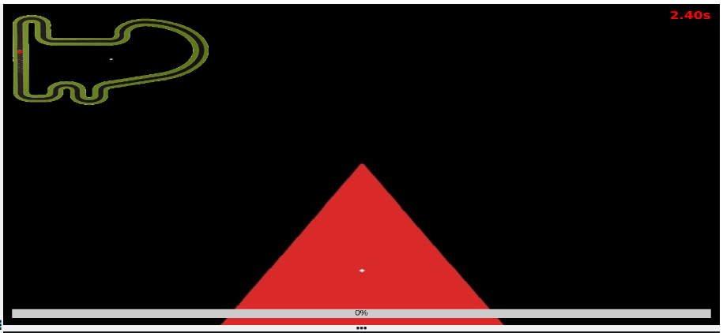
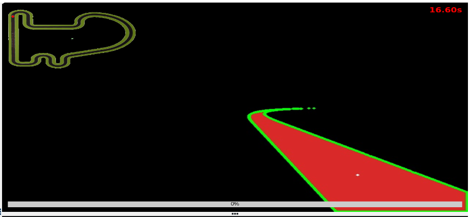
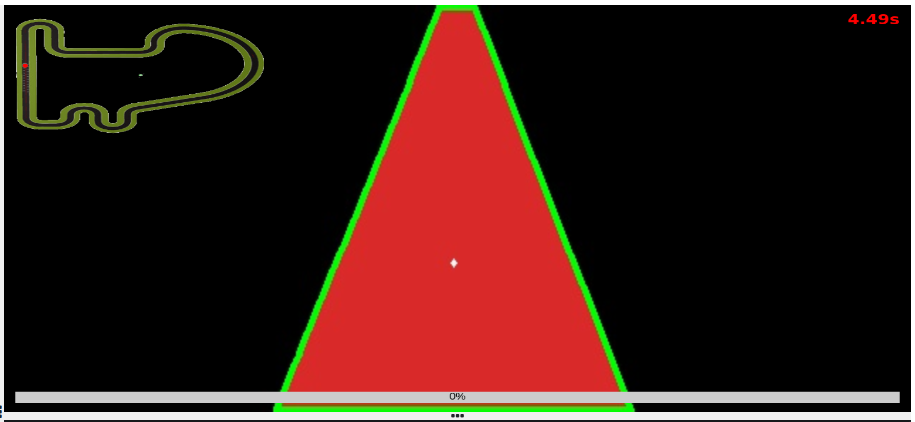

For this second practice I started searching how to do the image detection and the filtering of the line. Thanks to our sources I was able to apply a mask to the image in order to only select the red line and sow it in the display.



After being able to show the camera image I started thinking about selecting the line pixel by pixel in order to find the center, but then when looking throught our sources I saw the moments opencv function and I choose to use it. By searching through various webs I discovered a snippet of code to show the centroid of the line, this is made by changing the image to grayscale, finding the thresholds and the contours, and with that, using the moments, locating the centroid of the line. After adapting some parts of the code this was the result:



Whith this done I started working on the controller. Firstly with a simple proportional one. This is when i noticed that in some parts, especially on the turns, the program wasn't locating the center correctly. By outlining the countours I noticed that due to the camera and the shape of the line, when a turn came, the contours were not done correctly:



This was easily fixed by cropping the top half of the image. I also cropped some of the bottom to improve the detection.



With this fixed, I continued working whith the P controller, it works simply by setting the angular speed of the car with the error of the position of the center times a k value. When it worked decently, I added the derivative part to the controller using this formula:

```
d = kd * ((err - last_err) / elapsed_time)
```
elapsed_time is the time passed between the last postition of the center and the actual one.

Then I divided the PD int two, one for the staight lines and the other for the turns. Which one is used is determined by the error and if its high or low. The differences between the PDs are the values of kp and kd and the reduction of the linear speeds on the turns.

After that, I moved the center of the image to the right because the camera isn't placed exactly on the center of the car.

Finally, the time to configure kp and kd came and after a lot of tries and time spent, the car makes a lap under 2 minutes in the mayority of the tries. This process was especially long because first, i had to change the configuration of unibotics to remote due to the program putting too much stress on the computer, and secondly due to the camera not working properly in some cases leaving the car blind.

[video_p2.webm](https://github.com/psanchezf2021/robotica_movil_blog/assets/92941198/d6fd920c-ded0-4438-a77c-b1e261cb4b46)

Notice that the program is loading in the first seconds of the video.
