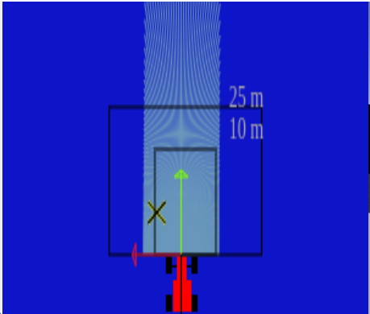
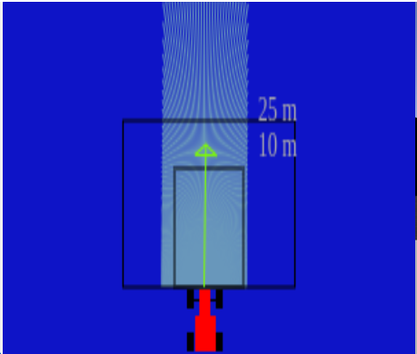
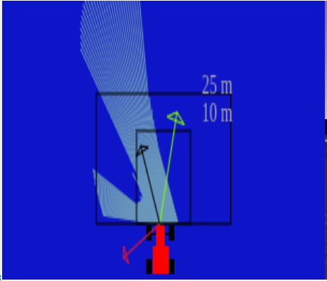

When I started this practice, I firstly got to know the forces and coordinated systems by adjusting the objectives of the car. First, using the function showLocalTarget(), I drew a test target on the coordinates [1,1].

Then by using the function absolute2relative and GUI.map.getNextTarget(), I was able to represent the real targets and take its coordinates. With a simple function comparing the position of the car with that of the target, the actual target would pass to the next one after the car reaches it, this i was able to test by setting the linear speed to a small value for the car to reach the first target (which is in the centre of the road).

With this done i started working on the forces, more specifically, on the attraction force. Firstly, I asjusted it to point directly to the target, but it was, understandably, too big, so I set a maximum and a minimum for the two components of the force.

For the obstacle force, I used the function parse_laser_data to get the information of the laser, and with each one of the obstacle point detected, I generated an opposing force inversely proportional to the distances of those points, that way, the closer a point is to the car, the stronger the opposing force is.

Adding this two forces, the result is the direction the car will be following also known as the average force.

To adjust the linear and angular velocities for the car to follow the average force, I firstly set a constant linear velocity and adjusted the angular with de tangent of the y component of the force divided by the x component (to get the angle of the force). By running some test I noticed the turns were too slow so the car didn't have time to react well, so I multiplied the result of the tangent by 2, this allowed to turn at sufficient speed.

For the linear velocity to lower when the car came closer to the targets, I set the linear velocity to be proportional to the x component of the average force. With this I had a problem: the car would slow down too much when it was about to reach a target so I multiplied de x component by 0.5 to reduce the speed that will be variable and added five to it, so it always would go at a sufficient speed, even if the x component is very small.

With this done the phase of adjusting force weights and the velocities controllers begun. After hours of trying it didn't seem like it would react correctly anytime soon, so I decided to use a PID controller for the angular speed, but it also didn't solve the problem. So I started searching through the code for any part that I could have thought of wrong. And my fist thought was that the angle was not being calculated right because it was one of the things that I calculated in the early phase of the project. So I started searching for the right calculations and it turns out that for finding the angle I was supposed to use the arctangent and not the tangent of the y component by the x component. With this fixed the car made its first lap without running into any obstacle.

Finally I started working on the last adjustments of the system. By adding a derivative part to the controller of the angular velocity and adjusting the weights of the repulsion force, the car run smoothly the entire lap. In the video some oscilations can be seen but this is just because of the lag caused by using the remote version of unibotics.