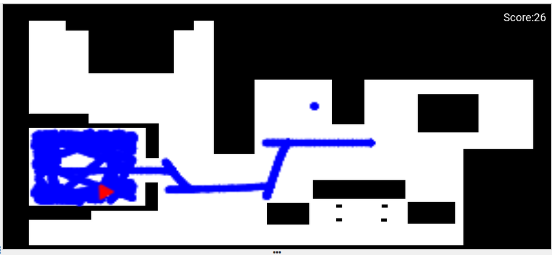

This is the first practical excersise of the subject, so first i had to
familiarize with unibotics and the tools we would be using. So firstly, i added
to the code the lasser functionality and tried some simple movements like moving
forward.

```
from GUI import GUI
from HAL import HAL
import math

def parse_laser_data(laser_data):
    laser = []
    for i in range(180):
        dist = laser_data.values[i]
        angle = math.radians(i)
        laser += [(dist, angle)]
    return laser

while True:
    HAL.setV(1)
```

Then I started working with the different states. I was hessitant between making
them in different functions or using ifs to switch cases in the while True, but
functions looked more convinient for me. I started with the most basic state:
going forward.

```
def state_forward(laser):
    HAL.setV(1)

while True:
    laser_data = HAL.getLaserData()
    laser = parse_laser_data(laser_data)
    state_forward(laser)
```

After that i made a function to check the distance of the laser and another
one for moving backwards (where the state forward will jump to when an obstacle
is detected).

```
def distance_check(laser):
    for distance, _ in (laser):
        if(distance < 0.4):
            return True
    return False

def state_forward(laser):
    HAL.setV(1)
    if(distance_check(laser)):
        state_back()
    
def state_back():
    HAL.setV(-1)
```

After I checked the detection was working I added the state turn, but it didn't
make much sense without first limiting the time of state_backwards so it stops
at a safe distance. So that is what I did, using time.time() by marking the
beginning of the motion and comparing it with the actual time, I limited
state_back and state_turn.

```
def state_back():
    HAL.setV(-1)
    
    start = time.time()
    while True:
        now = time.time()
        elapsed_time = now-start
        if(elapsed_time > 2):
            break
    HAL.setV(0)
    state_turn()

def state_turn():
    HAL.setW(1)
    
    start = time.time()
    while True:
        now = time.time()
        elapsed_time = now-start
        if(elapsed_time > 3-(random.random()*2)):
            break
    HAL.setW(0)
```

Next I added randomness to the turn's direction and duration using random.random().

```
def state_turn():
    if(random.random() <= 0.5):
        HAL.setW(1)
    else:
        HAL.setW(-1)
```

Now that i have a more or less working program, I ran some test on it. This is
is when i discovered an event which I call the Sisyphus robot, it consists on
the robot entering the most closed room and not being able to exit the room
not mattering how long it tried.



At this point i started working on the functionality for the spirals, but I 
noticed that with functions acting as the states I was overcomplicating the
program and I would run into some problems in the near future. So I decided to
reestructure the whole code and changing each state to be a case in a if/else
structure. While I was doing this, I added the spiral state, which would
activate at a random chance while the robot is in the forward state.

Running one of the test I noticed that two pieces of forniture have a thin layer
that the lasser is unable to detect, but it collides with the robot, so i added
the detection by bumber to avoid this.

```
if(distance_check(laser) or HAL.getBumperData().state == 1):
    HAL.setV(0)
    state = "back"
```

Then, after adjusting times and speeds the final program is finished. Notice
that because the turns are random, it has a hard time getting out of corners.


The video might have bad quality due to filming it while running the program
and then having converted it into a gif.
